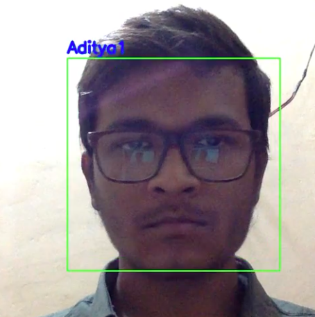

# Facial Recognition

Facial Recognition, these days are used at several places. Here is my simple implementation of facial recognition using OpenCV and KNN Machine Learning algorithm.

 

## How to use ?
To use this repository, you need to follow certain steps:

1. First, install libraries necessary to use this repo so:
   ```
   git clone https://github.com/adityak2920/FacialRecognition.git
   cd FacialRecognition
   pip install -r requirements.txt
   ```
2. Now, you need to have a haarcascade file, to detect faces out of everything in a frame. Here, I have provided haarcascade file for faces in data folder. So, just replace path of haarcascade file in scripts.(to learn more about haarcascade [click](https://towardsdatascience.com/computer-vision-detecting-objects-using-haar-cascade-classifier-4585472829a9)). 

3. Now, there are different scripts in ```src``` and here are the uses of those scripts.
   Functions of different files:
      1. ```facedata.py``` - for collecting data from laptop's web cam.
      2. ```face_ipwebcam.py``` - for collecting data from phone's camera(using an app called ipwebcam)
      3. ```recogn.py``` - for recognition of faces using laptop's web cam(we can also use phone's camera training by making some 
                      changes in the code like in faceipwebcam.py), here I have used KNN for training.
      4. ```data/.npy``` - After collecting data you need to save data in a separate folder these are the files containg data of images captured using facedata.py and faceipwebcam.py(here i have only captured 13 images of per person).
      
## Notes:
   To download ipwebcam app you can go to play store and search for the app. So, just download the app and navigate to streaming video option and then on that screen you will get a link, so just replace the link in ```face_ipwebcam.py``` with the link on the app.          
   Here is the drive link of video demo:-  [Video](https://drive.google.com/open?id=1So876Leh-Q9adzxb9-ZEe-Qvk7xjYHwq)
